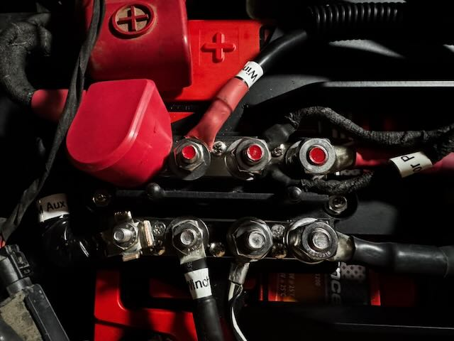
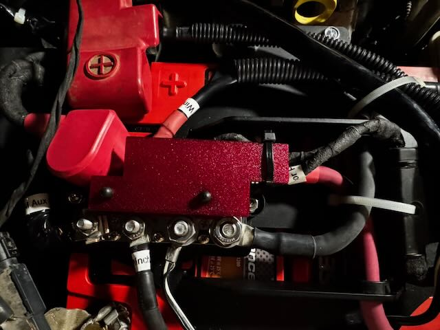

# Genesis Offroad Jeep JL Battery Cover

When doing some electrical work on my Jeep Wrangler JLU, I decided to install the [Genesis Offroad Stock Battery Replacement Kit](https://www.genesisoffroad.com/products/2018-jeep-jl-jt-stock-battery-replacement-kit_p_295).  While the kit is well thought out, it leaves several positive battery terminals exposed to accidental short-circuit.  This project creates a cover for those terminals.  

### Genesis Offroad Battery Replacement Before

### Genesis Offroad Battery Replacement After

### Bottom of the Cover

## Dependencies and Using the Component

This model is built using the tools listed below and must be installed in order to customize the model.

- [OpenSCAD](https://openscad.org)
- [The Belfry OpenScad Library, v2.0.](https://github.com/BelfrySCAD/BOSL2)

The `*.stl` files are rendered objects.
The `*.3mf` file is an [Orca Slicer](https://orcaslicer.com) project file.
